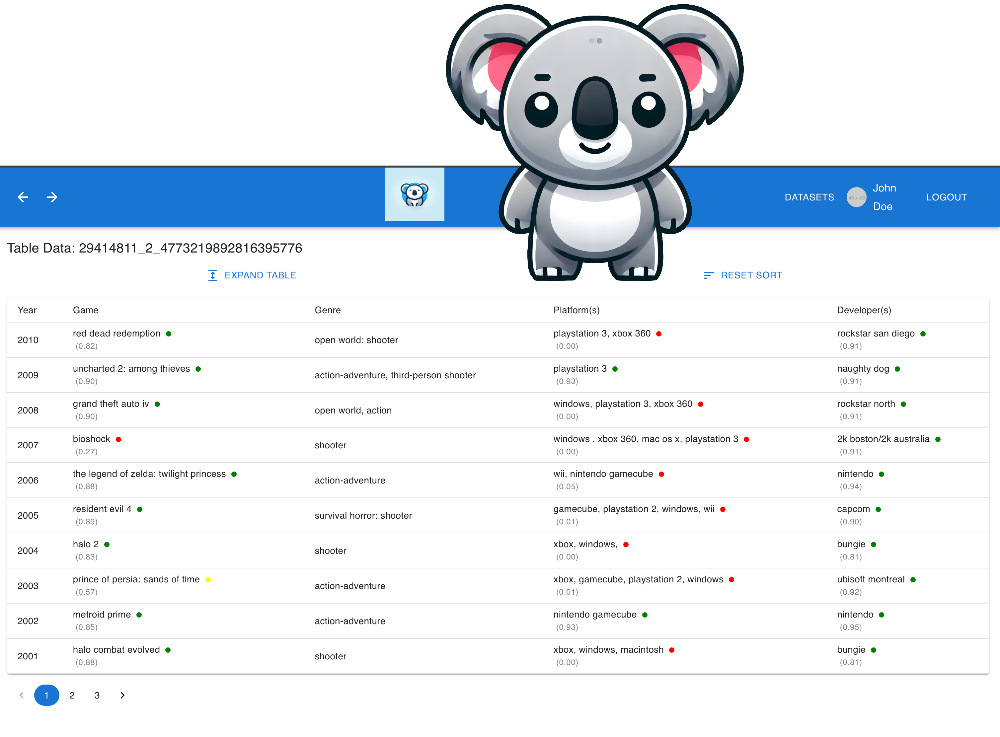

# Koala UI


Koala UI is a modern, user-friendly web application designed to explore and visualize entity linking results efficiently. It features a clean interface, easy navigation, and powerful data handling capabilities.

## Description

Koala UI is built with React and Material-UI, offering a seamless experience for users to manage and visualize datasets related to entity linking results. The application includes functionalities such as login authentication, dataset listing, table viewing, and detailed data visualization.

## Features

- User Authentication
- Dataset Listing
- Table Data Viewing
- Pagination
- Data Visualization
- Responsive Design
- Easy Navigation

## Installation

To get started with Koala UI, follow these steps:

1. **Clone the repository**
   ```bash
   git clone https://github.com/yourusername/koala-ui.git
   ```

2. **Navigate to the project directory**
   ```bash
   cd koala-ui
   ```

3. **Install dependencies**
   ```bash
   npm install
   ```

4. **Start the development server**
   ```bash
   npm start
   ```

### Docker Setup

Koala UI can also be run using Docker. Make sure you have Docker installed on your machine.

1. **Build and start the containers**
   ```bash
   docker-compose up --build
   ```

2. Access the application at `http://localhost:3000`.

## Usage

Once the server is running, you can access the application at `http://localhost:3000`. 

- **Login:** Use your credentials to log in.
- **Dataset Management:** View and manage your datasets.
- **Table Viewing:** Explore detailed data within tables.
- **Data Visualization:** Visualize data trends and insights.

## Screenshots



## Contributing

Contributions are welcome! Please fork the repository and create a pull request with your changes. Make sure to follow the contribution guidelines.

## License

This project is licensed under the MIT License - see the [LICENSE](LICENSE) file for details.

## Contact

For any questions or suggestions, please contact us at [roberto.avogadro@sintef.no](mailto:roberto.avogadro@sintef.no).

