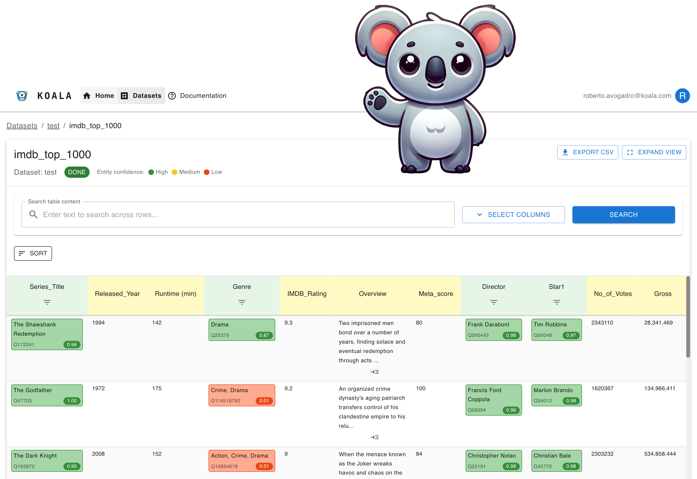

# Koala UI


Koala UI is a modern, user-friendly web application designed to upload, organize, and explore tabular datasets. It features a clean interface, easy navigation, and powerful data handling capabilities.

## Description

Koala UI is built with React and Material-UI, offering a seamless experience for users to manage and visualize datasets. The application includes functionalities such as login authentication, dataset listing, table viewing, column typing, and fast filtering.

## Features

- User Authentication
- Dataset Listing
- Table Data Viewing
- Pagination
- Data Visualization
- Native dataset & table storage in PostgreSQL
- Column typing (NE/LIT) with manual editing
- Search, filtering, and score-based sorting
- Responsive Design
- Easy Navigation

## Installation

To get started with Koala UI using Docker, follow these steps:

1. **Clone the repository**
   ```bash
   git clone https://github.com/enRichMyData/koala_ui
   ```

2. **Navigate to the project directory**
   ```bash
   cd koala-ui
   ```

3. **Copy the .env template to .env**
   ```bash
   cp .env.template .env
   ```

4. **Fill out the required environment variables in the .env file.**

   Example:
   ```env
   # Frontend environment variables
   REACT_APP_BACKEND_URL=http://localhost:5001

   # Common environment variables
   NODE_ENV=development
   FLASK_ENV=development
   JWT_SECRET_KEY=
   POSTGRES_DB=koala_db
   POSTGRES_USER=koala_user
   POSTGRES_PASSWORD=
   POSTGRES_PORT=5432
   DATABASE_URL=postgresql+psycopg2://koala_user:<password>@postgres:5432/koala_db
   ADMIN_EMAIL=
   ADMIN_PASSWORD=
   # Moose (automatic column identification)
   MOOSE_BASE_URL=https://moose.zooverse.dev
   MOOSE_API_KEY=

   # Shared LLM service (used by Moose and other features)
   LLM_PROVIDER=openrouter
   LLM_MODEL=
   LLM_API_KEY=
   LLM_ENDPOINT=

   # Versions
   NODE_VERSION=22
   PYTHON_VERSION=3.12
   POSTGRES_VERSION=16

   # Ports
   FRONTEND_PORT=3000
   BACKEND_PORT=5001
   POSTGRES_PORT=5432
   ```

5. **Build and start the containers**
   ```bash
   docker-compose up --build
   ```

6. **Access the application**
   Open your browser and go to `http://localhost:${FRONTEND_PORT}`.

## Running in Production

To run the application in production mode:

1. Build and start the containers:
   ```bash
   docker-compose -f docker-compose.prod.yml up --build
   ```

2. Access the application:
   - Frontend: `http://localhost:${FRONTEND_PORT}`
   - Backend: `http://localhost:${BACKEND_PORT}`

## Usage

Once the server is running, you can access the application at `http://localhost:${FRONTEND_PORT}`. 

- **Login:** Use your credentials to log in.
- **Dataset Management:** View and manage your datasets.
- **Table Viewing:** Explore detailed data within tables.
- **Column Typing:** Set NE/LIT types per column and request auto-identification (placeholder).


## Data Format Specification

Koala UI exposes a dataset/table API optimized for pagination, search, filtering, and column typing.

### Dataset Structure

```json
{
  "data": [
    {
      "datasetName": "string",
      "totalTables": "number",
      "totalRows": "number",
      "createdAt": "ISO timestamp"
    }
  ],
  "pagination": {
    "next_cursor": "string|null",
    "prev_cursor": "string|null"
  }
}
```

### Table Data Structure

```json
{
  "data": {
    "dataset_name": "string",
    "table_name": "string",
    "header": ["column1", "column2", "column3"],
    "rows": [
      {
        "idRow": 0,
        "data": ["cell_value_1", "cell_value_2", "cell_value_3"],
        "row_score": 0.92,
        "row_types": ["PERSON", "DATE"]
      }
    ],
    "classified_columns": {
      "NE": {
        "0": "PERSON"
      },
      "LIT": {
        "2": "DATE"
      }
    },
    "column_types": {
      "0": {
        "types": [
          {
            "id": "PERSON",
            "name": "PERSON",
            "count": 100,
            "frequency": 1.0
          }
        ]
      }
    },
    "classification_status": "MANUAL|AUTO_PENDING|UNSET",
    "score_column": 3,
    "score_column_name": "score",
    "status": "READY",
    "total_rows": 500,
    "total_matches": 50
  },
  "pagination": {
    "next_cursor": "string|null",
    "prev_cursor": "string|null"
  }
}
```

### Required Fields

#### Dataset Level
- `datasetName`: Unique identifier for the dataset
- `totalTables`: Number of tables in the dataset
- `totalRows`: Total number of rows across all tables

#### Table Level
- `header`: Array of column names
- `rows`: Array of data rows
- `status`: Processing status ("READY")
- `classification_status`: Column typing status ("MANUAL", "AUTO_PENDING", "UNSET")

#### Row Level
- `idRow`: Unique identifier for the row
- `data`: Array of cell values corresponding to header columns
- `row_score`: Parsed numeric score (if score column is detected)
- `row_types`: Array of column type labels present in the row

#### Column Classification
- `classified_columns.NE`: Named Entity columns with their subtypes
- `classified_columns.LIT`: Literal columns with their subtypes
- `column_types`: Type distribution information per column

### Supported Column Types

#### Named Entity (NE) Types
- `PERSON`: Person names
- `LOCATION`: Geographic locations
- `ORGANIZATION`: Organizations and institutions
- `OTHER`: Other named entities

#### Literal (LIT) Types
- `DATE`: Date values
- `NUMBER`: Numeric values
- `STRING`: Text literals
- `OTHER`: Other literal types

### API Endpoints

Koala UI exposes the following endpoints:

```
GET /datasets                          - List datasets
GET /datasets/{name}/tables           - List tables in dataset
GET /datasets/{name}/tables/{table}   - Get table data
POST /datasets/{name}/tables/upload   - Upload new table
DELETE /datasets/{name}/tables/{table} - Delete table
GET /datasets/{name}/tables/{table}/status - Get processing status
GET /datasets/{name}/tables/{table}/export - Export CSV
PUT /datasets/{name}/tables/{table}/columns/classification - Update column types
POST /datasets/{name}/tables/{table}/columns/identify - Request auto-identification (placeholder)
```

### Example Integration

To integrate your data source with Koala UI:

1. Implement the required API endpoints
2. Format your data according to this specification
3. Configure Koala UI to point to your backend URL
4. Add reconciliation integrations later if needed

For future reconciliation integration, add your linker behind the placeholder endpoint.

## Screenshots



## Contributing

Contributions are welcome! Please fork the repository and create a pull request with your changes. Make sure to follow the contribution guidelines.

## License

This project is licensed under the MIT License - see the [LICENSE](LICENSE) file for details.

## Contact

For any questions or suggestions, please contact us at [roberto.avogadro@sintef.no](mailto:roberto.avogadro@sintef.no).
