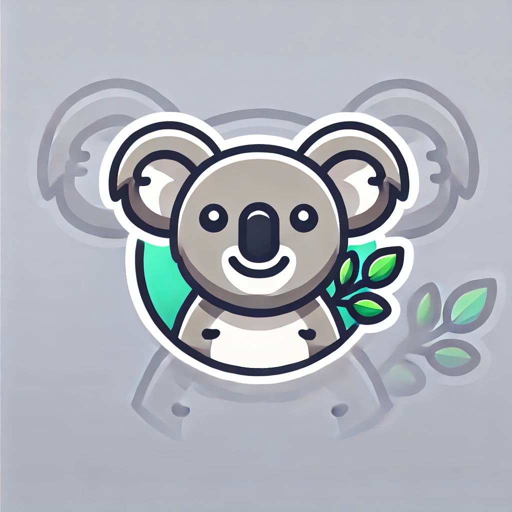

# Koala UI



Koala UI is a modern, user-friendly web application designed to explore and visualize entity linking results efficiently. It features a clean interface, easy navigation, and powerful data handling capabilities.

## Description

Koala UI is built with React and Material-UI, offering a seamless experience for users to manage and visualize datasets related to entity linking results. The application includes functionalities such as login authentication, dataset listing, table viewing, and detailed data visualization.

## Features

- User Authentication
- Dataset Listing
- Table Data Viewing
- Pagination
- Data Visualization
- Responsive Design
- Easy Navigation

## Installation

To get started with Koala UI using Docker, follow these steps:

1. **Clone the repository**
   ```bash
   git clone https://github.com/roby-avo/koala_ui
   ```

2. **Navigate to the project directory**
   ```bash
   cd koala-ui
   ```

3. **Copy the .env template to .env**
   ```bash
   cp .env.template .env
   ```

4. **Fill out the required environment variables in the .env file.**

   Example:
   ```env
   # Frontend environment variables
   REACT_APP_BACKEND_URL=http://localhost:5001
   REACT_APP_ALLIGATOR_URL=
   REACT_APP_ALLIGATOR_TOKEN=
   REACT_APP_LAMAPI_URL=
   REACT_APP_LAMAPI_TOKEN=

   # Common environment variables
   NODE_ENV=development
   FLASK_ENV=development

   # Versions
   NODE_VERSION=22
   PYTHON_VERSION=3.12
   MONGO_VERSION=7.0

   # Ports
   FRONTEND_PORT=3000
   BACKEND_PORT=5001
   MONGO_PORT=27017
   ```

   Note: Fill in `REACT_APP_ALLIGATOR_URL`, `REACT_APP_ALLIGATOR_TOKEN`, `REACT_APP_LAMAPI_URL`, and `REACT_APP_LAMAPI_TOKEN` based on where your instances of Alligator and LamAPI are running.

5. **Build and start the containers**
   ```bash
   docker-compose up --build
   ```

6. **Access the application**
   Open your browser and go to `http://localhost:3000`.

### Prerequisites

Ensure you have active instances of Alligator and LamAPI running. You can find more information and instructions on setting up these services in their respective repositories:
- [Alligator](https://github.com/roby-avo/alligator)
- [LamAPI](https://github.com/roby-avo/lamapi)

## Usage

Once the server is running, you can access the application at `http://localhost:3000`. 

- **Login:** Use your credentials to log in.
- **Dataset Management:** View and manage your datasets.
- **Table Viewing:** Explore detailed data within tables.
- **Data Visualization:** Visualize data trends and insights.

## Screenshots


## Contributing

Contributions are welcome! Please fork the repository and create a pull request with your changes. Make sure to follow the contribution guidelines.

## License

This project is licensed under the MIT License - see the [LICENSE](LICENSE) file for details.

## Contact

For any questions or suggestions, please contact us at [roberto.avogadro@sintef.no](mailto:roberto.avogadro@sintef.no).
